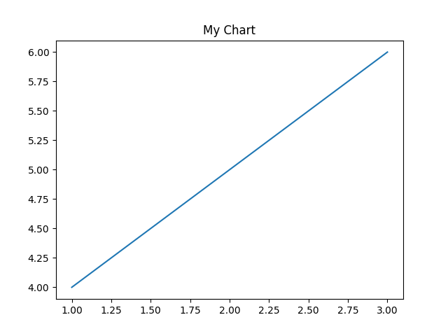

# MCP Server for Generating Chart Image (FastMCP + FastAPI)

This is a MCP Server for generating chart images from Python code

## Requirements

- Python 3.11+
- [FastMCP](https://github.com/ohgyun/fastmcp)
- [FastAPI](https://github.com/tiangolo/fastapi)
- [uvicorn](https://github.com/encode/uvicorn)
- [python-dotenv](https://github.com/theskumar/python-dotenv)
- [requests](https://github.com/psf/requests)
- [matplotlib](https://github.com/matplotlib/matplotlib)

## Usage

```bash
$ git clone https://github.com/qnnpnet/chart-mcp-server.git
$ cd chart-mcp-server
$ uv sync
$ uv run main.py
```

## Generate Chart Image

```bash
$ curl -X POST http://localhost:8107/generate_chart \
  -H "Content-Type: application/json" \
  -d '{"code": "import matplotlib.pyplot as plt\nplt.plot([1,2,3],[4,5,6])\nplt.title(\"My Chart\")"}'
```

### Response

```json
{ "image_url": "http://localhost:8107/static/images/20250419160332_d8b758e9.png" }
```

### Result


